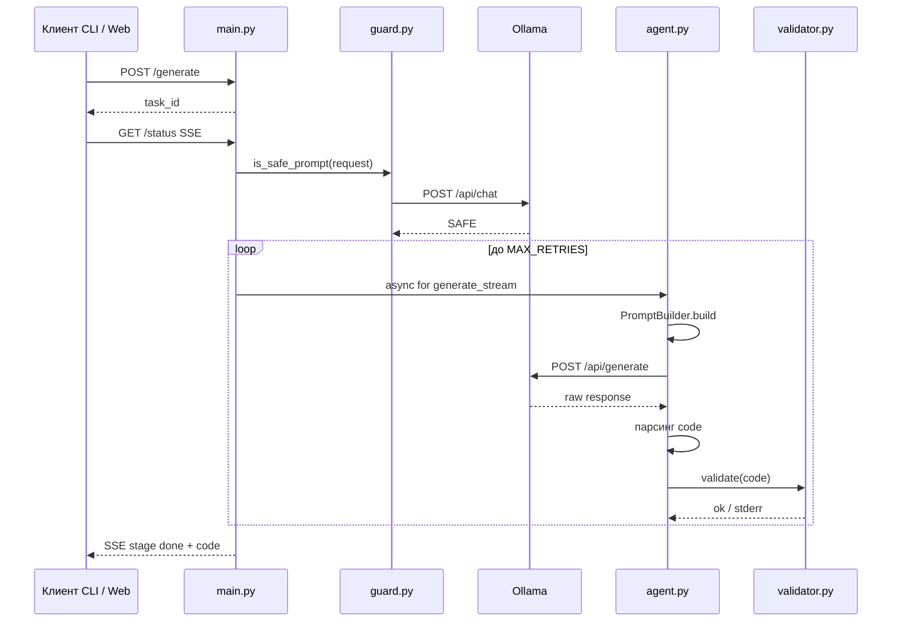
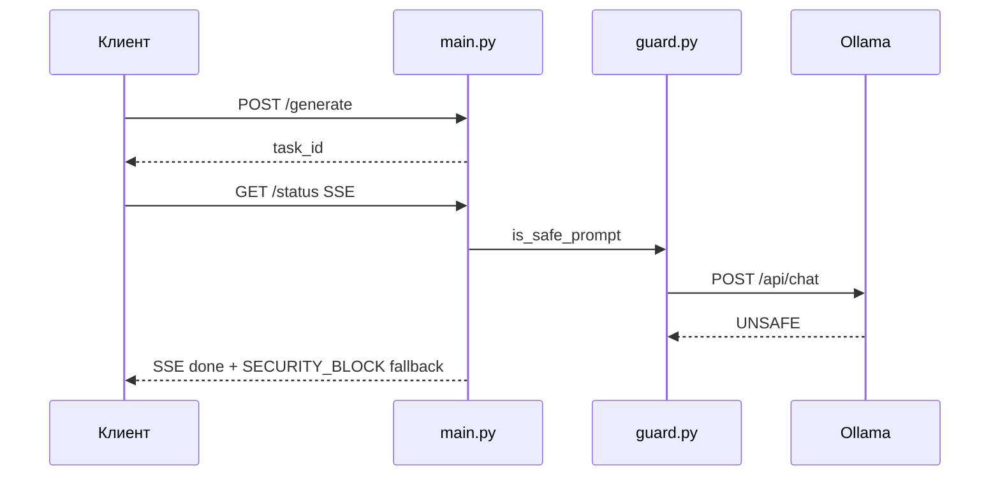

# Архитектура LocalScript — C4 (описание)

Визуальные диаграммы C1–C3 (Mermaid flowchart, прямые рёбра): [архитектура_С4_визуал.md](архитектура_С4_визуал.md).

Ниже — **уровень C4** в терминах текущего кода: модули, очередь задач, стадии SSE, сценарии и ограничения.

---

## C4 — Границы модулей и ответственность

| Компонент                    | Файл                    | Назначение                                                                                                                                                                        |
| ---------------------------- | ----------------------- | --------------------------------------------------------------------------------------------------------------------------------------------------------------------------------- |
| HTTP + жизненный цикл задачи | `api/main.py`           | FastAPI, CORS, `GET /health`, `POST /generate`, `GET /status` (SSE), словарь `TASKS`, `BackgroundTasks`, очередь `asyncio.Queue` на задачу, `run_pipeline_task`                   |
| Security Guard               | `api/guard.py`          | `is_safe_prompt` (Ollama `/api/chat`, промпт из `prompts/system-prompt-guard.txt`), хард-блок фразы, `sanitize_output` для утечек в коде                                          |
| Пайплайн генерации           | `api/agent.py`          | `AgentPipeline.generate_stream`, `AsyncOllamaClient`, парсинг `<code>` / fenced block, retry до `MAX_RETRIES`, стадии `generating` / `validating` / `retrying` / `done` / `error` |
| Сборка промпта               | `api/prompt_builder.py` | `system_prompt.txt` + `context` + текст ошибки `luac`                                                                                                                             |
| Валидация синтаксиса         | `api/validator.py`      | `subprocess`: `luac -o /dev/null -`; обход через `DRY_RUN=true`                                                                                                                   |
| Контракты DTO                | `api/models.py`         | `GenerateRequest`, `TaskSubmitResponse`, описание полей SSE-событий                                                                                                               |

Клиенты не входят в репозиторий Python как пакеты, но по контракту участвуют в архитектуре:

| Клиент | Путь                                    | Протокол к API                                         |
| ------ | --------------------------------------- | ------------------------------------------------------ |
| CLI    | `cli-client/chat.py`                    | `POST /generate`, чтение SSE `GET /status?task_id=...` |
| Web UI | `web-ui/` (`lib/api.js`, `app/page.js`) | то же                                                  |

---

## C4 — Поток данных: постановка задачи и SSE

1. Клиент: `POST /generate` с телом `{"prompt", "context"?}`.
2. `main.py`: создаётся `task_id`, в `TASKS[task_id]` кладётся `queue`, `status`, `final_code`; в фоне стартует `run_pipeline_task`.
3. Ответ клиенту: `200` + JSON `{"task_id": "..."}`.
4. Клиент: `GET /status?task_id=...` с `Accept: text/event-stream`.
5. `EventSourceResponse`: в поток уходят JSON-строки вида `{"stage","message","code","error"}` (см. `docs/api_contract_description.md`).
6. Если задача уже в терминальном состоянии (`done` / `error`), отдаётся короткий «fast»-поток из одного чанка.

---

## C4 — Sequence: успешный проход (guard SAFE → код → luac OK)

---

## C4 — Sequence: блокировка Guard (UNSAFE)

При ошибке вызова guard в коде зафиксировано «fail-open» (`return True`) — детали в `api/guard.py`.

---

## C4 — Уточняющий ответ без кода (clarification)

Если в ответе модели **нет** извлекаемого блока кода, `AgentPipeline` отдаёт `stage: done` с текстом в `message` и пустым `code`. Клиенты обязаны не засорять `context` служебными статусами SSE — см. [КЛИЕНТ_КОНТЕКСТ_КОНТРАКТ.md](КЛИЕНТ_КОНТЕКСТ_КОНТРАКТ.md).

---

## C4 — Стадии SSE (ориентир для UI и тестов)

| `stage`      | Смысл                                               |
| ------------ | --------------------------------------------------- |
| `pending`    | Очередь, в т.ч. сообщение про проверку безопасности |
| `generating` | Вызов LLM для кода                                  |
| `validating` | Проверка `luac`                                     |
| `retrying`   | Синтаксическая ошибка, следующая попытка            |
| `done`       | Успех, блокировка guard или «только текст»          |
| `error`      | Исчерпаны попытки или внутренняя ошибка пайплайна   |

Поле `code` на промежуточных стадиях может обновляться «снимками»; перед отдачей клиенту код проходит `sanitize_output` в `main.py`.

---

## C4 — Инфраструктура и окружение

- **Docker:** `docker-compose.yml` (CPU) и `docker-compose-nvidia-gpu.yml` (NVIDIA); сервисы `ollama`, `model-puller`, `api`.
- **Переменные:** `OLLAMA_BASE_URL`, `OLLAMA_MODEL`, `MAX_RETRIES`, `DRY_RUN`, `OLLAMA_NUM_CTX`, `OLLAMA_NUM_PREDICT` — см. `[README.md](../README.md)` и `[DEBUGGING.md](DEBUGGING.md)`.
- **Лимиты контекста:** обрезка `context` в `main.py` (`MAX_CONTEXT_CHARS`) и в агенте / guard (см. `api/main.py`, `api/agent.py`, `api/guard.py`).

---

## C4 — Риски и ограничения

| Риск              | Пояснение                                                         |
| ----------------- | ----------------------------------------------------------------- |
| In-memory `TASKS` | Нет персистентности; рестарт процесса теряет задачи               |
| Один процесс API  | Несколько реплик без общего хранилища ломают адресацию `task_id`  |
| `DRY_RUN=true`    | Пропуск `luac`; не использовать как «боевой» режим на стенде жюри |
|                   |                                                                   |

