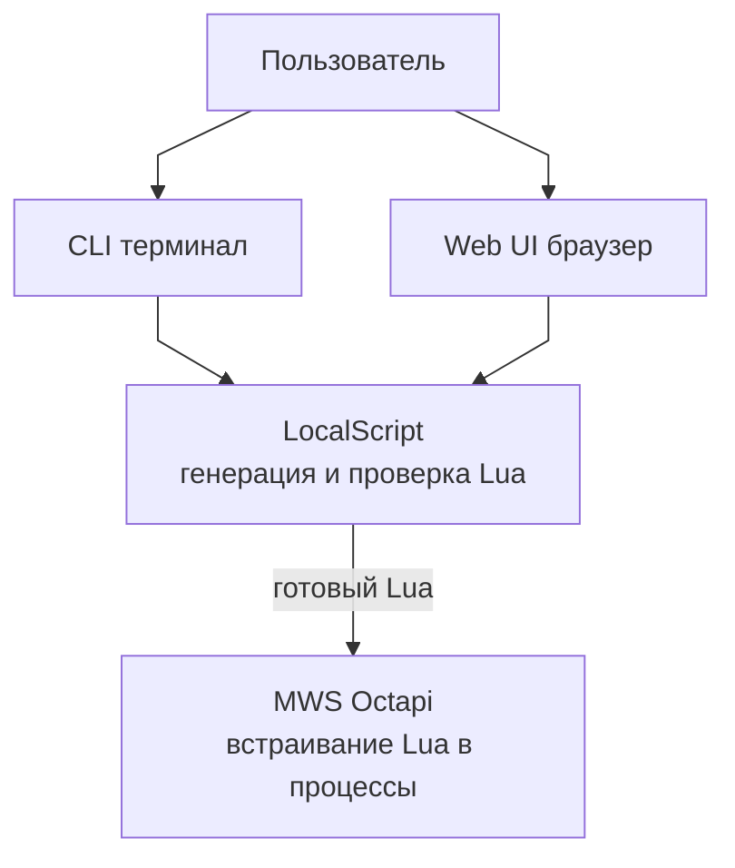
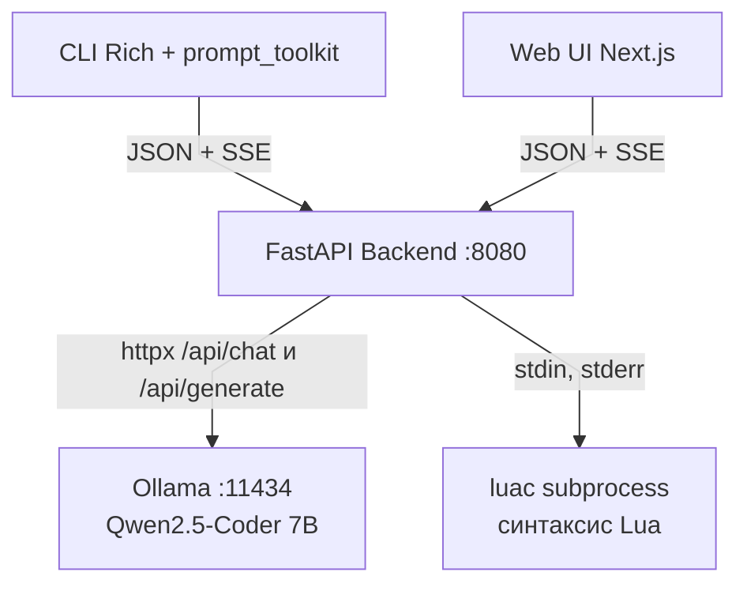
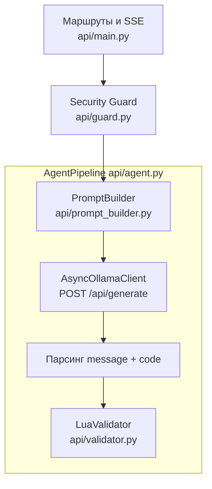

# Архитектура LocalScript — C1–C3 (визуал)

Диаграммы в [Mermaid flowchart](https://mermaid.js.org/syntax/flowchart.html) с **`curve: linear`** (прямолинейные рёбра, без сильной кривизны). Узлы выстроены **сверху вниз** и **колонками**, чтобы минимизировать пересечения линий и наложения.

Текстовое описание уровня **C4** и сценарии по шагам: [архитектура_С4-описание.md](архитектура_С4-описание.md).

---

## C1 — System Context

---

## C2 — Containers

Один столбец для клиентов → API; от API — два независимых прямых исходящих ребра вниз к **Ollama** и **luac** (без «диагональных» пересечений через центр).

---

## C3 — Components (внутри FastAPI)

Линейная цепочка **Router → Guard → Agent**; внутри агента — линейный конвейер одной попытки генерации (цикл retry в текстовом описании C4).

